# Software setup

Below are the instructions for setting up the project. Feel free to inspect and improve the documentation of this project

## Configure the Raspbian image

### Download Raspbian

1. Download `latest-raspbian-stretch.zip` from this link (later versions will not work with the project): [Download link here](https://downloads.raspberrypi.org/raspbian/../images/raspbian-2019-04-09/)

2. Extract the contents of the `.zip` file and delete it, this will continue with the `.img` file onwards

### Burn the image

Burn the image onto the SD card using the methods below

#### Using `dd` (Mac and Linux only)

- **On Mac**

1. Open a terminal

2. Find the SD card's disk label with `diskutil list`
  
   ```zsh
   /dev/disk0 (internal, physical): #: TYPE NAME SIZE IDENTIFIER 0:GUID_partition_scheme *800.2 GB disk0 1: EFI WRONG_DISK 209.7 MB disk0s1 2:Apple_CoreStorage WRONG_DISK 799.3 GB disk0s2 3: Apple_Boot WRONG_DISK 650.0 MBdisk0s3

   /dev/disk1 (internal, virtual): #: TYPE NAME SIZE IDENTIFIER 0: Apple_HFS WRONG_DISK+798.9 GB disk1 Logical Volume on disk0s2 00000000-0000-0000-0000-000000000000Unlocked Encrypted
   /dev/disk2 (external, physical): #: TYPE NAME SIZE IDENTIFIER 0:FDisk_partition_scheme *15.8 GB disk2 1: Windows_NTFS WRONG_DISK 15.8 GB disk2s1

   /dev/disk3 (external, physical): #: TYPE NAME SIZE IDENTIFIER 0:FDisk_partition_scheme *31.9 GB disk3 1: Windows_FAT_32 RIGHT_DISK 43.5 MB disk3s1 2:Linux 31.9 GB disk3s2
   ```

   (The SD card appears on this machine as **/dev/disk3**)

3. Unmount the SD card from the machine

   `$ diskutil unmountDisk /dev/disk3`

4. Burn the Raspbian image onto the disk

   `$ sudo dd bs=8m if=PATH_TO_IMAGE/2019-04-08-raspbian-stretch.img of=/dev/disk3`

   Output:

   ```zsh
   221+1 records in 
   221+1 records out 
   1858076672 bytes transferred in 399.146789 secs (4655121 bytes/sec)
   ```

- **On Linux**

1. Open the terminal
2. Find the SD card's disk label using `lsblk`

   `$ lsblk`

   ```zsh
   NAME   MAJ:MIN RM   SIZE RO TYPE MOUNTPOINT
   sda      8:0    0 465.8G  0 disk 
   └─sda1   8:1    0 465.7G  0 part 
   sdb      8:16   0 465.8G  0 disk 
   └─sdb1   8:17   0 465.7G  0 part 
   sdc      8:32   0 465.8G  0 disk 
   ├─sdc1   8:33   0    94M  0 part /boot/efi
   ├─sdc2   8:34   0 122.1G  0 part /
   ├─sdc3   8:35   0    16M  0 part 
   └─sdc4   8:36   0 343.6G  0 part 
   sdd      8:48   0   1.8T  0 disk 
   └─sdd1   8:49   0   1.8T  0 part /media/user/some_junk_hdd
   sde      8:64   1  29.8G  0 disk 
   ├─sde1   8:65   1   256M  0 part /media/user/boot
   └─sde2   8:66   1   2.1G  0 part /media/user/rootfs
   ```

   (The SD card appears on this machine as **/dev/sde**)

3. Unmount the disk

   `$ umount /dev/sde`

4. Burn the disk with `dd`

   `$ sudo dd if=PATH_TO_IMAGE/2019-04-08-raspbian-stretch.img of=/dev/sde`

   Output:

   ```zsh
   415+0 records in
   415+0 records out
   3481272320 bytes (3.5 GB, 3.2 GiB) copied, 99.5757 s, 35.0 MB/s
   ```

#### Using [`balenaEtcher`](https://www.balena.io/etcher/)

1. Download and install a flashing tool like [balenaEtcher](https://www.balena.io/etcher/)

2. In your flashing tool of choice, select the SD card on the machine and the Raspbian image to be flashed

3. Flash the SD card and wait until finished

   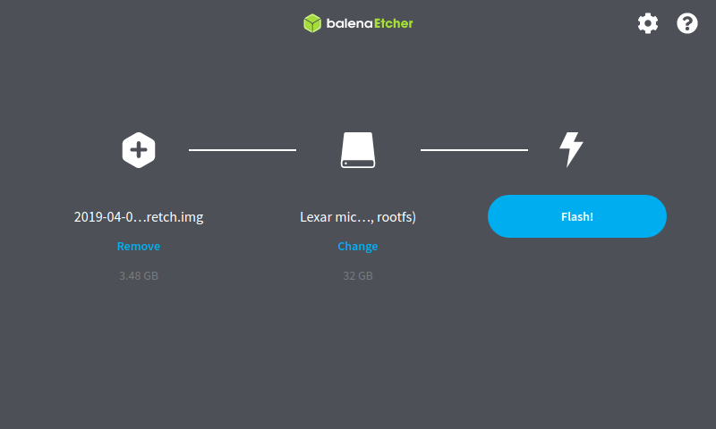

### Configure the SD card for headless mode

1. Remount the SD card onto the machine once more (use cli tools or simply reinsert the SD card)

2. Navigate to the `boot` partition of the SD card

3. Create a blank `.ssh` file inside the directory

## Configure the Raspberry Pi admin credentials

1. Insert the flashed SD card into the Pi, and boot up the Pi

2. Attach the Pi to your machine via the Ethernet port ([or the OTG port if using a Pi Zero](https://learn.adafruit.com/turning-your-raspberry-pi-zero-into-a-usb-gadget/ethernet-gadget))

3. SSH into your Pi

   `$ ssh pi@raspberrypi.local`

   or

   `$ ssh pi@PI_IP_ADDRESS`

   ```zsh
   user@user:~$ ssh pi@raspberrypi.local
   The authenticity of host 'raspberrypi.local (IP_ADDRESS)' can't be established.
   ECDSA key fingerprint is SHA256:SOME_FINGERPRINT_HERE.
   Are you sure you want to continue connecting (yes/no/[fingerprint])? yes
   Warning: Permanently added 'raspberrypi.local' (ECDSA) to the list of known hosts.
   Warning: the ECDSA host key for 'raspberrypi.local' differs from the key for the IP address 'IP_ADDRESS'
   Offending key for IP in /home/user/.ssh/known_hosts:12
   Are you sure you want to continue connecting (yes/no)? yes
   pi@raspberrypi.local's password: 
   Linux raspberrypi 4.14.98-v7+ #1200 SMP Tue Feb 12 20:27:48 GMT 2019 armv7l

   The programs included with the Debian GNU/Linux system are free software;
   the exact distribution terms for each program are described in the
   individual files in /usr/share/doc/*/copyright.

   Debian GNU/Linux comes with ABSOLUTELY NO WARRANTY, to the extent
   permitted by applicable law.
   Last login: Thu Jun  3 01:13:55 2021

   SSH is enabled and the default password for the 'pi' user has not been changed.
   This is a security risk - please login as the 'pi' user and type 'passwd' to set a new password.

   pi@raspberrypi:~ $ 
   ```

4. Update the Pi's default passwords. Repeat for the `root` user as well

   `$ passwd`

   ```zsh
   pi@raspberrypi:~$ passwd
   Changing password for pi.
   Current password: 
   New password: 
   Retype new password: 
   passwd: password updated successfully
   ```

   ```zsh
   root@raspberrypi: passwd
   Changing password for root.
   Current password: 
   New password: 
   Retype new password: 
   passwd: password updated successfully
   ```

5. Configure the Pi's hardware using `raspi-config`

   `$ sudo raspi-config`

   - Edit the hostname. Let's call ourselves `hackBox2021` as an example

      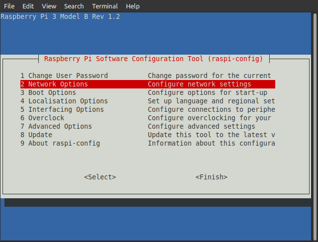
      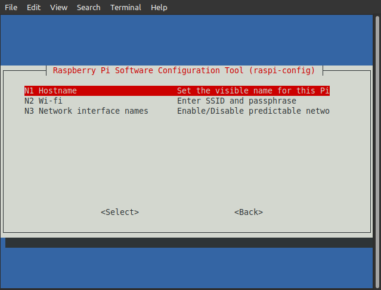
      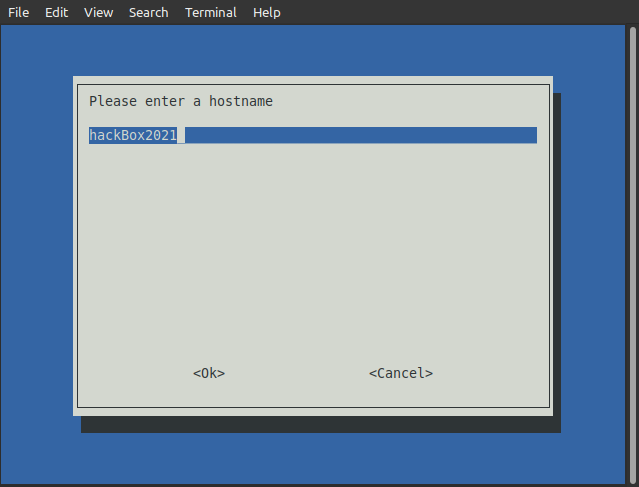

   - Configure network boot

      
      
      
      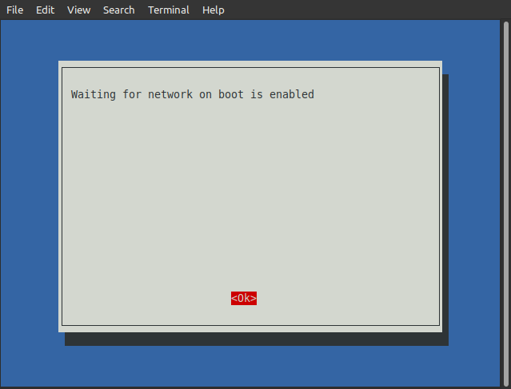

   - Configure the hardware serial (required when talking to the GSM Hat)

      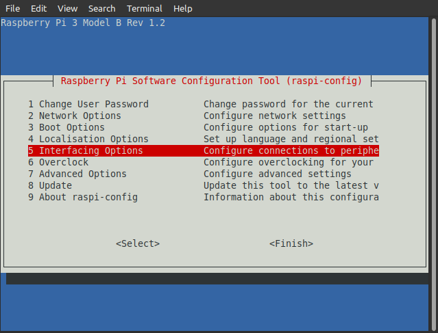
      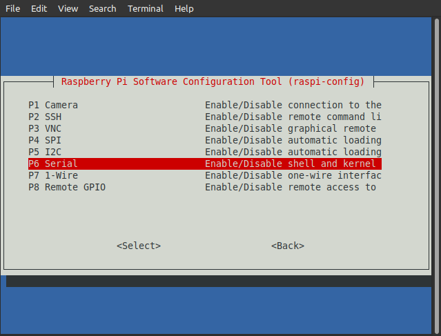
      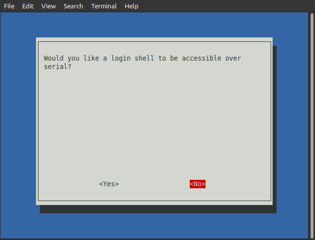
      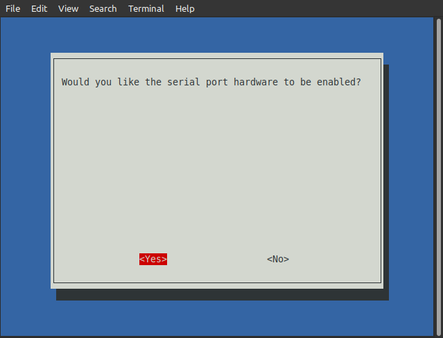
      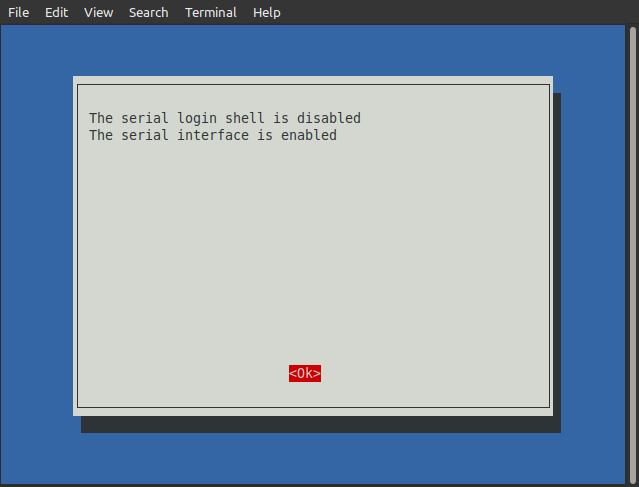

   - Finish it off and reboot

      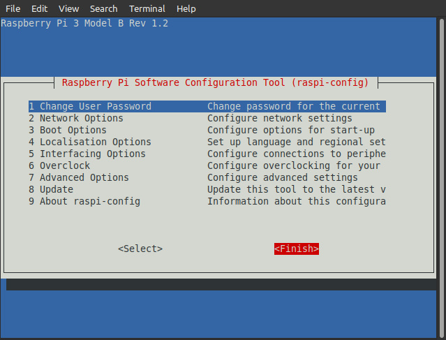
      

6. Reconnect using the new hostname and password

   `$ ssh pi@hackBox2021.local`

   ```zsh
      user@user:~$ ssh pi@hackBox2021.local
      The authenticity of host 'hackbox2021.local (IP_ADDRESS)' can't be established.
      ECDSA key fingerprint is SHA256:SOME_FINGERPRINT_HERE.
      Are you sure you want to continue connecting (yes/no/[fingerprint])? yes
      Warning: Permanently added 'hackbox2021.local' (ECDSA) to the list of known hosts.
      pi@hackbox2021.local's password: 
      Linux hackBox2021 4.14.98-v7+ #1200 SMP Tue Feb 12 20:27:48 GMT 2019 armv7l

      The programs included with the Debian GNU/Linux system are free software;
      the exact distribution terms for each program are described in the
      individual files in /usr/share/doc/*/copyright.

      Debian GNU/Linux comes with ABSOLUTELY NO WARRANTY, to the extent
      permitted by applicable law.
      Last login: Thu Jun  3 02:07:37 2021 from IP_ADDRESS
      pi@hackBox2021:~ $ 

   ```

## Download and run the install scripts

1. Make sure the system has `git` installed, otherwise install it with:

   `$ sudo apt-get install git`

   Verify by checking the git version

   ```zsh
   pi@hackBox2021:~ $ git --version
   git version 2.11.0
   pi@hackBox2021:~ $ 
   ```

2. Download the install scripts from the Git repository

   `git clone https://github.com/cellphonedude/shells-on-cells`

3. Navigate to the scripts folder, and give the scripts execute privileges

   `cd shells-on-cells/scripts && chmod +x ./*.sh`

4. Run the scripts in this order
   1. [**`1stboot.sh`**](../scripts/1stboot.sh) - Updates the Pi image and regenerates the host SSH keys
   2. [**`2ndboot.sh`**](../scripts/2ndboot.sh) - Downgrades the kernel to the latest supported kernel (4.14) and the latest supported nexmon drivers
   3. [**`preinstall.sh`**](../scripts/3rdboot.sh) - Downloads fun tools, prerequisites for driver installation, and kernel source
   4. [**`postinstall-pizerow.sh`**](../scripts/postinstall-pizerow.sh)/[**`postinstall-pi3.sh`**](../scripts/3rdboot.sh) - Downloads nexmon from git, and builds the drivers. Run the script denoted by device name, and also as `root`
   5. [**`kismetinstall.sh`**](../scripts/kismetinstall.sh) - Installs kismet-stable and adds the user **pi** to the `kismet` group

## Configure SSH credentials

1. Generate a SSH key pair on the Raspberry Pi

   ```zsh
   mkdir ~/.ssh
   chmod 700 ~/.ssh
   ssh-keygen -f ~/.ssh/ptdb_name_rsa -t rsa -b 4096 -N ''
   ```

   ```zsh
   pi@hackBox2021:~ $ mkdir ~/.ssh
   pi@hackBox2021:~ $ chmod 700 ~/.ssh
   pi@hackBox2021:~ $ ssh-keygen -f ~/.ssh/ptdb_name_rsa -t rsa -b 4096 -N ''
   Generating public/private rsa key pair.
   Your identification has been saved in /home/pi/.ssh/ptdb_name_rsa.
   Your public key has been saved in /home/pi/.ssh/ptdb_name_rsa.pub.
   The key fingerprint is:
   SHA256:SOME_FINGERPRINT_HERE pi@hackBox2021
   The key's randomart image is:
   +---[RSA 4096]----+
   |                 |
   |                 |
   |                 |
   |                 |
   |  (Random Art)   |
   |                 |
   |                 |
   |                 |
   |                 |
   +----[SHA256]-----+
   pi@hackBox2021:~ $ 

   ```

2. Open `/etc/rc.local` for editing

   `sudo nano /etc/rc.local`

3. Overwrite `/etc/rc.local` with the [contents of this file](../examples/etc-rc.local)

4. Note this line from the modified `rc.local`

   `autossh -fN -R <ptdb port>:localhost:<c2 port for ptdb> <c2 user>@<c2 domain> -p <c2 port for com> -i /home/pi/.ssh/<nodename_rsa> &`

   Change the following parameters:

   - `<ptdb port>` - The port used for listening to ssh connections
   - `<c2 port for ptdb>` - The port used by the cloud instance to talk to your Pi
   - `<c2 user>` - The user's cloud username
   - `<c2 domain>` - The user's cloud domain
   - `<c2 port for com>` - The port used by the Pi to talk to your cloud instance
   - `<nodename_rsa>` - The identity file, generated previously above

TODO

## Configure your cloud credentials

TODO